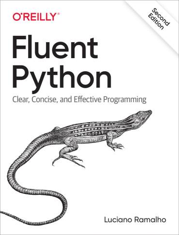
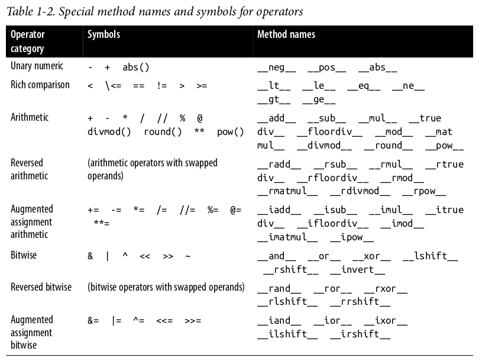
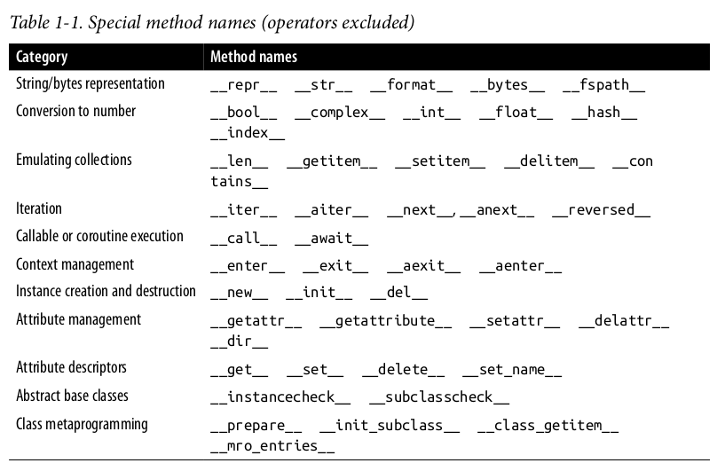
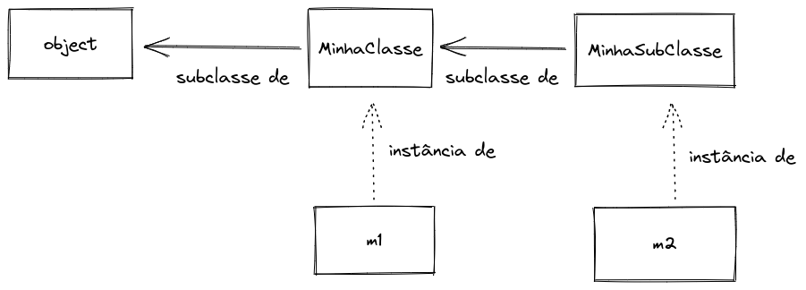
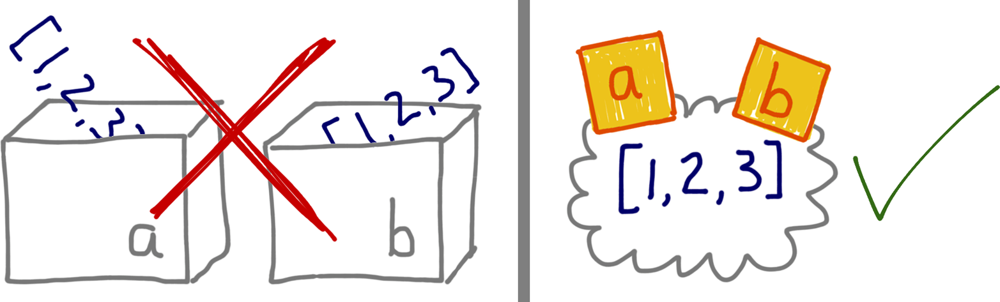
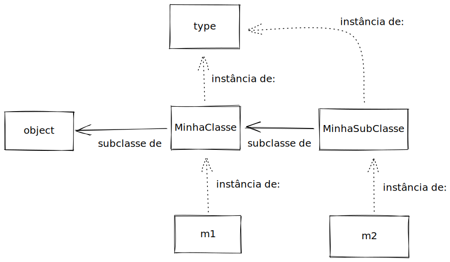
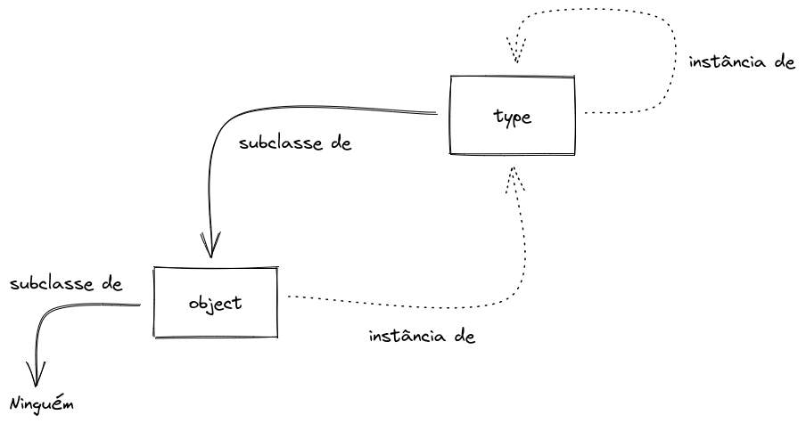
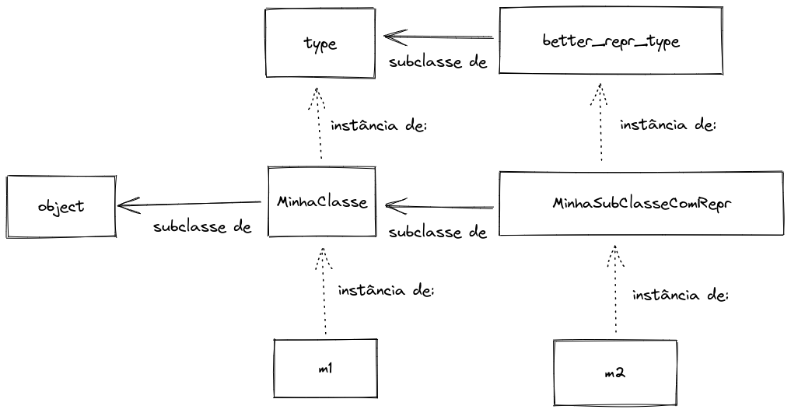

# Metaclasses

## Pra que servem?

## Onde vivem?

## Como se reproduzem?

Leonardo Rochael Almeida

23-Outubro-2022

Note:

Intro: 5 min.

Lançar IPython em %doctest_mode

Lançar x11vnc

Lançar Remote Desktop Viewer

---



Note:

Trabalho com Python há 21 anos.

Meu primeiro emprego com Python foi tendo o Luciano Ramalho como chefe.

E tive a honra de revisar tanto a 1ª quanto a 2ª ed. do Fluent Python.

E fui vítima da maldição do conhecimento.

---

## Mas primeiro: dois tipos de métodos

* Métodos normais:
  * Como declarar: `def metodo(self):`
  * Como usar: `objeto.metodo()`
* Métodos especiais
  * Como declarar: `def __str__(self):`
  * Como usar: `print(objeto)`

Note:

Método normal é o que você acessa com "pontinho".

Método especial é um que quem normalmente acessa é o Python
para fazer algo especial com uma instância da sua classe.

---



Note:

Fonte: Fluent Python Second Edition

Por exemplo, esses são todos os métodos especiais que sua classe pode
implementar, e permitem que a instância da classe participe de operações com
operadores matemáticos, mais, vezes, etc.

---



Note:

Fonte: Fluent Python Second Edition

Já esses métodos especiais são todos os outros que não tem a ver com
participar de operações.

Tem métodos especiais para sua classe ser chamada como se fosse uma função,
indexada como se fosse uma lista ou dicionário, fornecer um comprimento com
`len()`, especificar sua representação no console etc.

---



Note:

[Source](https://excalidraw.com/#room=1c8d72d1ecb12684899d,44bhxgUJPAwiO3oXuNRoJw)

Mostrar `slides/code/slide0_methods.py`

```text
from slide0_methods import *


m1 = MinhaClasse()

m2 = MinhaSubClasse()


m1.dobrar()

m1.x = 7

m1.dobrar()

m2.dobrar()

m1

m2

def __call__(self, other):
    return self.x + other

MinhaClasse.__call__ = __call__

m2(7)

```

---

## Sequência de busca: métodos normais

(e atributos normais)

0. instância
1. classe
2. superclasses

---

## Sequência de busca: métodos especiais

(métodos "dunder": `__...__`)

0. ~~instância~~ **NÃO**!
1. classe
2. superclasses

---

## Toda hora é *runtime*

Em Python declarações de função e de classe "acontecem" em
**tempo de execução**.

Note:

Classes são criadas em tempo de execução,

Mas imports só "rodam" o módulo uma vez.

Demonstrar com prints por todos os lados:

* `slides/code/slide1_runtime.py`

---

## Tudo é objeto (1)



<font size="1">
Imagem © Luciano Ramalho, usada com permissão
</font>

Classes são valores também!

Note:

Em Python, todas as coisas declaradas tem variáveis atribuídas, inclusive
funções e classes!

Classes (e funções) podem ser atribuídas a variáveis, listas e dicionários.

Demonstrar sobrescrever as variáveis nas quais as classes foram declaradas,
e instanciar as classes através das variáveis nas quais foramm salvas.

```text
a = [1, 2, 3]
b = a
b.append(4)
b
a
```

Posso atribuir classes a outras variáveis

```text
MinhaClasse2 = MinhaClasse

instancia2 = MinhaClasse2()

MinhaClasse = None

instancia = MinhaClasse()
```

Posso colocar classes em listas, ou colocá-las em dicionários

Inclusive, o conteúdo de módulos importados fica em um dicionário:

```text
slide1_runtime.__dict__.keys()

{key: value for key, value in slide1_runtime.__dict__.items() if not key.startswith('__')}
```

Assim como o conteúdo de classes e instâncias:

```python
m1.__dict__
MinhaSubClasse.__dict__
```

Como meu amigo Lalo Martins diria:

> Python é feito apenas de dicionários e toneladas de açúcar sintático

---

## As duas responsabilidades de `class`

```python
class Pato:
    ...
```

* Gerar uma classe
* Atribuir à classe uma variável
  * Com mesmo nome da classe

Note:

`class` não é uma "declaração". É um comando estruturado.

As mesmas duas responsabilidades valem para `def` e funções.

O que significa que dá pra criar classes dentro de funções.

E também é possível criar funções dentro de funções.

---

## Tudo é objeto (2)

Todos os valores têm uma classe

* inclusive classes!

Note:

Demonstrar `obj.__class__`, `type(obj)` e `isinstance(obj, class)`

```text
pato.__class__
type(pato)

pato.__class__ is type(pato)

pato.__class__ is slide1_runtime.Pato

```

---

## Tudo é objeto (3)

* Criando classes dinamicamente

Note:

demonstrar `slides/code/slide5_dynamic_class.py`

```text
from slide5_dynamic_class import *

m3 = MinhaSubClasse()
m3.dobrar()
m3.somar()

MinhaSubClasse.__class__

MinhaOutraSubClasse = meu_gerador_de_subclasse(27)

m4 = MinhaOutraSubClasse()
m4.dobrar()
m4.somar()

MinhaOutraSubClasse.__bases__
MinhaOutraSubClasse.__name__
MinhaOutraSubClasse.__class__

MinhaSubClasseMaisDinamica = type(
    'MinhaSubClasseMaisDinamica',  # o nome da classe
    (MinhaClasse, MeuMixin),  # superclasses
    {'x': 27},  # "namespace" da classe
)

# Inclusive com métodos

def __init__(self, x):
    self.x = x

MinhaSubClasseRealmenteDinamica = type(
    'MinhaSubClasseRealmenteDinamica',
    (MinhaClasse, MeuMixin),
    {'__init__': __init__},
)
```

Para criar uma instância, eu invoco a classe.

Para criar dinamicamente uma classe, eu invoco a classe da classe.

---



Note:

[Origem](https://excalidraw.com/#room=238469586b20a3132da2,8WP2bHrBNSR7GZ257qVWRA)

---

## Metaclasse: a classe da classe

* `type`: a classe das classes por padrão
  * 1 parâmetro: retorna a classe de um objeto
  * 3 parâmetros: cria uma nova classe

Note:

Metaclasse é o nome que damos à classe de uma classe

E `type` é a metaclasse padrão de todas as classes

---

## "`type`" & "`object`"

uma relação peculiar



Note:

[Origem](https://excalidraw.com/#room=1f3517d27415d387d3ff,go5T1JAv3yH1fx5wenTlqA)

Mas se `type` é uma (meta)classe, de quem ela é subclasse?

E se `object`, que é uma classe, também é uma instância, quem é a classe de
`object`?

```text
>>> type(object)
<class 'type'>
>>> type(type)
<class 'type'>
>>> type.__class__
<class 'type'>
>>> type.__bases__
(<class 'object'>,)
>>> object.__bases__
()
```

**A relação entre `object` e `type` não pode ser construída em Python.**

Faz parte da definição da linguagem.

---

## Criando novas metaclasses

* Herdando de `type`

```python
class better_repr_type(type):
    ...
```

Note:

Se `type` é uma classe, posso herdar de `type`?

`slides/code/slide9_better_repr.py`

```text

from slide9_better_repr import *

MinhaSubClasseComRepr = better_repr_type(
    'MinhaSubClasseComRepr',  # nome
    (MinhaClasse, MeuMixin),  # bases
    {'__init__': __init__},   # atributos / métodos
)
```

---



Note:

[Source](https://excalidraw.com/#room=1076797d69bd2c569513,l33QvHS3xBgAcPXs-WptjA)

---

## Usando metaclasses em classes "normais"

```python
class MinhaClasse(Super, ..., metaclass=MinhaMetaClasse):
    ...
```

Note:

```python
class MinhaSubClasseComRepr2(MinhaClasse, metaclass=better_repr_type):
    def __init__(self, x):
        self.x = x
```

---

## Mas pra que servem afinal? (1)

* Dar métodos especiais às classes
  * `__repr__`
  * `__getitem__`
  * `__(...)__`

---

## Mas pra que servem afinal? (2)

* Preparar o `namespace` (`.__dict__`) de uma classe
* Interceptar/registrar/customizar criação de classes
* Manipular métodos e atributos da classe durante criação
* Interceptar/customizar criação de instâncias

Note:

`slides/code/slide12_walkthru.py`

Walkthru completo do processo de declaração de uma classe

Debugar passo a passo no vs.code

Sobrescrever o `__call__` da metaclasse pra retornar `None`.

* Interceptar/customizar criação de instâncias
  * `__call__`
    * Redundante com `__new__` da classe

---

## Pra que NÃO servem?

* Influenciar instâncias depois de criadas
* Fornecer atributos ou métodos **normais** às classes
  * apenas métodos especiais!

Note:

MRO de atributos normais nunca passa pela metaclasse.

---

## Você (provavelmente) nunca vai precisar de metaclasses (1)

* `SuperClass.__init_subclass__()`
  * Invocado a cada subclasse declarada
    * Mesmo nas subclasses indiretas
  * Mas não na classe onde é declarada

---

## Você (provavelmente) nunca vai precisar de metaclasses (2)

Decoradores:

```python
@decorador
class MinhaClasse:
    ...
```

* Um bom exemplo:
  * `@dataclasses.dataclass`

Note:

Um decorador recebe a classe já pronta, e têm a oportunidade de modificá-la, e
até substituí-la, antes de retorná-la.

Um bom exemplo existente é `@dataclass`, que cria métodos nas suas classes.

---

## Você (provavelmente) nunca vai precisar de metaclasses (3)

* `__class_getitem__`
  * Usado pelo Python para *type hints*

```python
def print_steps(steps: list[str]): ...
```

Note:

Mostrar `slides/code/slide20_meta_alternatives.py`

```python
from slide20_meta_alternatives import *

Anseriforme['Pato']

@verifica_anseriforme
class Cachorro(Pato):
    def quack(self):
        print("au, au!")

class Gato(Pato):
    def quack(self):
        print("miau!")

Anseriforme['Cachorro']

```

---

## Classes também aceitam palavras chaves

```python
class MinhaSubClasse(SuperCls, palavra='Chave', numero=42):
    ...
```

* Mas é necessário consumi-las:
  * Onde:
    * `MetaClass.__new__()`
    * `SuperClass.__init_subclass__()`
  * Pois `object.__init_subclass__()` não as aceita.

Note:

E já que estamos falando de customização de classes, uma coisa interessante é
que classes aceitam *keyword arguments* além de `metaclasse=`

Devem ser consumidas no `__new__` da metaclasse, ou no `__init_subclass__` de
uma classe mãe.

Abrir `slides/code/slide12_walkthru.py` ao lado de
`slides/code/slide23_keywords.py` e debugar.

---

## SQLModel: exemplo de palavra chave em classes

```python
from sqlmodel import Field, SQLModel

class Hero(SQLModel, table=True):
    id: int = Field(primary_key=True)
    name: str
    secret_name: str
    age: int
```

* https://sqlmodel.tiangolo.com/

Note:

A ausência do `table=` indica que o ORM não deve criar
uma tabela para registros desta classe.

Mas subclasses de uma tal classe podem declarar `table`.

---

## Resumindo

* Tudo tem classes, inclusive as classes
* Metaclasses fornecem métodos especiais para classes
  * E apenas métodos especiais
* Metaclasses não têm nenhuma influência sobre instâncias da classe
  * busca de métodos/atributos não flui pra metaclasse
* Você pode criar (meta)classes pras suas classes
  * Mas provavelmente não precisa

Note:

Tem gente que acha que Python é uma linguagem objetificante... Tudo é objeto!

Eu prefiro pensar que Python é uma linguagem muito classuda! Tudo tem muita classe!

Metaclasses ajudam a linguagem a evoluir (`__init_subclass__`, `__class_getitem__`).

Metaclasse é pra quem está fazendo frameworks, como SQLAlchemy ou Pydantic.

Se você se pergunta se precisa usar metaclasses, certeza que não precisa ;-)

Quem precisa sabe exatamente porque precisa.

---

## Perguntas?

----

```python
from autostring import AutoString

class SaborDeSorvete(AutoString):
    creme
    morango
    chocolate
```

---

## Obrigado!

GH: [leorochael/2022-10-23-Talk-PythonBrasil-Metaclasses](https://github.com/leorochael/2022-10-23-Talk-PythonBrasil-Metaclasses)


https://www.linkedin.com/in/leorochael/

Telegram: `@LeoRochael`

email: `leorochael@gmail.com`

<font size="4" style="text-align: left">
PS: Quer trabalhar em Berlin? Fale comigo! Pessoa Dev. Sr. ou Data Eng. Sr. q
</font>
