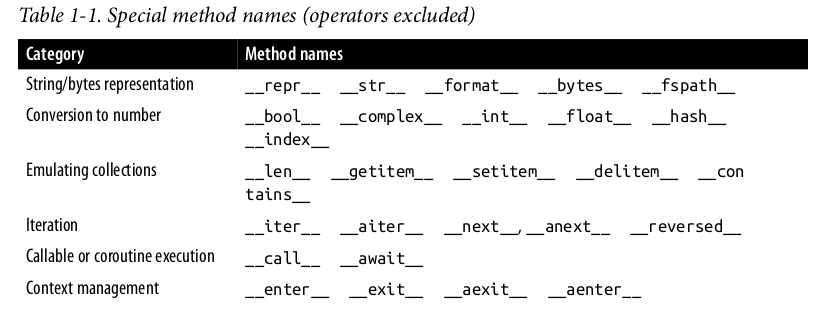
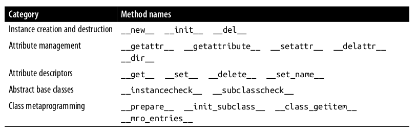

# Metaclasses

## Pra que servem?

## Onde vivem?

## Como se reproduzem?

Leonardo Rochael Almeida

23-Outubro-2022

Note:

Intro: 5 min.

Lançar IPython em %doctest_mode

Lançar x11vnc

Lançar Remote Desktop Viewer

---


Nota:

Trabalho com Python a 21 anos.

Meu primeiro emprego com Python foi tendo o Luciano Ramalho como chefe.

E tive a honra de revisar tanto a 1ª quanto a 2ª ed. do Fluent Python.

E fui vítima da maldição do conhecimento.

---

## Mas primeiro: dois tipos de métodos

* Métodos (e atributos) normais:
  * `objeto.metodo()`
* Métodos especiais
  * ex: `def __bool__(self): ...`

Note:

Método normal é o que você acessa com "pontinho".

Método especial é um que quem normalmente acessa é o Python
para fazer algo especial com uma instância da sua classe.

---




---


---


Note:

Mostrar `slides/code/slide0_methods.py`

```text
from slide0_methods import *

m1.dobrar()

m1.x = 7

m1.dobrar()

m2.dobrar()

m1

m2

def __call__(self, other):
    return self.x + other

MinhaClasse.__call__ = __call__

m2(7)

```

---

## Sequência de busca: métodos normais

(e atributos normais)

* instância
* classe
* superclasses

Note

---

## Sequência de busca: métodos especiais

* **~instância~ NÃO**!
* classe
* superclasses

---

## Toda hora é *runtime*

Em Python declarações de função e de classe "acontecem" em
**tempo de execução**.

Note:

Classes são criadas em tempo de execução,

Mas imports só "rodam" o módulo uma vez.

Demonstrar com prints por todos os lados:

* `slides/code/slide1_runtime.py`

---

## Tudo é objeto (1/3)


<font size="1">
Imagem © Luciano Ramalho, usadas com permissão
</font>

Classes são valores também!

Note:

Em Python, todas as coisas declaradas tem variáveis atribuídas, inclusive
funções e classes!

Classes (e funções) podem ser atribuídas a variáveis, listas e dicionários.

Demonstrar sobrescrever as variáveis nas quais as classes foram declaradas,
e instanciar as classes através das variáveis nas quais foramm salvas.

```text
a = [1, 2, 3]
b = a
b.append(4)
b
a
```

Posso atribuir classes a outras variáveis

```text
MinhaClasse2 = MinhaClasse

instancia2 = MinhaClasse2()

MinhaClasse = None

instancia = MinhaClasse()
```

Posso colocar classes em listas:

```text
minhas_classes = [MinhaClasse2, MinhaSubClasse]

instancia3 = minhas_classes[0]()

instancia3.dobrar()
```

Ou colocá-las em dicionários:

```text
meu_mapa_de_classes = {
    'classe_a': MinhaClasse2,
    'classe_b': slide1_runtime.Pato,
}

pato2 = meu_mapa_de_classes['classe_b']()
pato2.quack()
```

Inclusive, o conteúdo de módulos importados fica em um dicionário:

```text
slide1_runtime.__dict__.keys()

{key: value for key, value in slide1_runtime.__dict__.items() if not key.startswith('__')}
```

Assim como o conteúdo de classes e instâncias

Como meu amigo Lalo Martins diria:

> Python é feito apenas de dicionários e toneladas de açúcar sintático

---

## As duas responsabilidades de `class`

```python
class Pato:
    ...
```

* Gerar uma classe
* Atribuir à classe uma variável
  * Com mesmo nome da classe

Note:

`class` não é uma "declaração". É um comando estruturado.

As mesmas duas responsabilidades valem para `def` e funções.

O que significa que dá pra criar classes dentro de funções.

E também é possível criar funções dentro de funções.

---

## Tudo é objeto (2/3)

Todos os valores têm uma classe

* inclusive classes!

Note:

Demonstrar `obj.__class__`, `type(obj)` e `isinstance(obj, class)`

```text
pato.__class__
type(pato)

pato.__class__ is type(pato)

pato.__class__ is slide1_runtime.Pato

```

---

## Tudo é objeto (3/3)

* Criando classes dinamicamente

Note:

demonstrar `slides/code/slide5_dynamic_class.py`

```text
from slide5_dynamic_class import *

m3 = MinhaSubClasse()
m3.dobrar()
m3.somar()

MinhaSubClasse.__class__

MinhaOutraSubClasse = meu_gerador_de_subclasse(27)

m4 = MinhaOutraSubClasse()
m4.dobrar()
m4.somar()

MinhaOutraSubClasse.__bases__
MinhaOutraSubClasse.__name__
MinhaOutraSubClasse.__class__

MinhaSubClasseMaisDinamica = type(
    'MinhaSubClasseMaisDinamica',  # o nome da classe
    (MinhaClasse, MeuMixin),  # superclasses
    {'x': 27},  # "namespace" da classe
)

# Inclusive com métodos

def __init__(self, x):
    self.x = x

MinhaSubClasseRealmenteDinamica = type(
    'MinhaSubClasseRealmenteDinamica',
    (MinhaClasse, MeuMixin),
    {'__init__': __init__},
)
```

Para criar uma instância, eu invoco a classe.

Para criar dinamicamente uma classe, eu invoco a classe da classe.

---


Note:

[Origem](https://excalidraw.com/#room=238469586b20a3132da2,8WP2bHrBNSR7GZ257qVWRA)

---

## Metaclasse: a classe da classe

* `type`: a classe das classes
  * 1 parâmetro: retorna a classe de um objeto
  * 3 parâmetros: cria uma nova classe

Note:

Classes são resultado da invocação de uma metaclasse, assim como uma instância é resultado da invocação de uma classe.

---

## `type` e `object` uma relação especial


Note:

[Origem](https://excalidraw.com/#room=1f3517d27415d387d3ff,go5T1JAv3yH1fx5wenTlqA)

Mas se `type` é uma (meta)classe, de quem ela é subclasse?

E se `object` é uma classe de quem as outras classes herdam,
de quem ele é instância?

```text
>>> type(object)
<class 'type'>
>>> type(type)
<class 'type'>
>>> type.__class__
<class 'type'>
>>> type.__bases__
(<class 'object'>,)
>>> object.__bases__
()
```

---

## Criando novas metaclasses

* Herdando de `type`

```python
class better_repr_type(type):
    ...
```

Note:

`slides/code/slide9_better_repr.py`

```text

from slide9_better_repr import *

MinhaSubClasseComRepr = better_repr_type(
    'MinhaSubClasseComRepr',  # nome
    (MinhaClasse, MeuMixin),  # bases
    {'__init__': __init__},   # atributos / métodos
)
```

---

## Usando metaclasses em classes "normais"

```python
class MinhaClasse(Super, ..., metaclass=MinhaMetaClasse):
    ...
```

Note:

```python
class MinhaSubClasseComRepr2(MinhaClasse, metaclass=better_repr_type):
    def __init__(self, x):
        self.x = x
```

---

## MRO: Por onde atributos fluem?

* Atributos normais: `obj.atrib` ou `obj.metodo()`
* Em instâncias:
  * instância
  * classe
  * superclasses
* Em classes
  * Da classe pras superclasses
* **Metaclasses não entram na brincadeira**!

Note:

Para atributos/métodos normais, sendo acessados via `obj.attr()`, essa é a
ordem.

```text
MinhaSubClasseComRepr2.__mro__
```

---

## Métodos especiais (`__repr__` ...)

* Em instâncias:
  * classe
  * superclasses
  * **NÃO na ~instância~**!
* Em classes
  * apenas na metaclasse
    * (e superclasses da metaclasse)

Note:

Para métodos especiais, quando o Python usa sua instância para operações
especiais, como indexação, uso com operadores, etc. a busca é assim.

---

## "Walk-thru"

Note:

10 min.

Walkthru completo do processo de declaração de uma classe

Elaborar uma metaclasse com prints nos métodos especiais:

Debugar passo a passo no vs.code

---

## Mas pra que servem afinal? (1/3)

* Métodos especiais para classes!

* Registrar/Interceptar/customizar criação de classes
  * `__new__` / `__init__`
* Manipular métodos e atributos da classe durante criação

Note:

Relembrar walkthru

---

## Mas pra que servem afinal? (2/3)

* Interceptar/customizar criação de instâncias
  * `__call__`
    * Mas redundante com `__new__` da classe

Note:

Sobrescrever o `__call__` da metaclasse pra retornar `None`.

---

## Mas pra que servem afinal? (3/3)

* Dar efeitos especiais às classes
  * `__repr__`
  * `__getitem__`
  * `__(...)__`

Note:

Mencionar como typing já usa essas definições em list.

---

## Pra que não servem?

* Não influenciam instâncias já criadas.
* Não dão atributos ou métodos novos para classes

Note:

Exceto na criação (`__call__`), como mencionamos antes.

Falar sobre `__mro__`.

---

## Você (provavelmente) nunca vai precisar de meta-classes (1/2)

* `__init_subclass__`
  * Invocado a cada subclasse declarada
    * Mesmo nas subclasses indiretas
  * Mas não na classe onde é declarada

Note:

Mostrar `slides/code/slide20_init_subclass.py`

---

## Você (provavelmente) nunca vai precisar de meta-classes (2/2)

Decoradores:

```python
@decorador
class MinhaClasse:
    ...
```

* Um bom exemplo:
  * `@dataclasses.dataclass`

Note:

Debugar `slides/code/slide22_decorator.py`

---

## Classes também aceitam palavras chaves

```python
class MinhaSubClasse(SuperCls, palavra='Chave', numero=42):
    ...
```

* Mas é necessário consumi-las:
  * Onde:
    * `MetaClass.__new__()`
    * `Class.__init_subclass__()`
  * Pois `object.__init_subclass__()` não as aceita.

Note:

Devem ser consumidas no `__new__`, ou no `__init_subclass__`.

---

## SQLModel: exemplo de palavra chave em classes

```python
from sqlmodel import Field, SQLModel

class Hero(SQLModel, table=True):
    id: int = Field(primary_key=True)
    name: str
    secret_name: str
    age: int
```

* https://sqlmodel.tiangolo.com/

Note:

A ausência do `table=` indica que o ORM não deve criar
uma tabela para registros desta classe.

Mas subclasses de uma tal classe podem declarar `table`.

---

## Resumindo

* Tudo tem classes, inclusive as classes
* Metaclasses dão efeitos especiais para classes
  * métodos `__*__`
* Metaclasses não tem nenhuma influência sobre instâncias da classe
  * busca de métodos/atributos não flui pra metaclasse
* Você pode criar (meta)classes pras suas classes
  * Mas provavelmente não precisa

Note:

---

## Perguntas?

---

## Obrigado!

https://www.linkedin.com/in/leorochael/

PS: Pessoa Dev. Sr. ou Data Eng. Sr. que quer trabalhar em Berlin, fale comigo!
